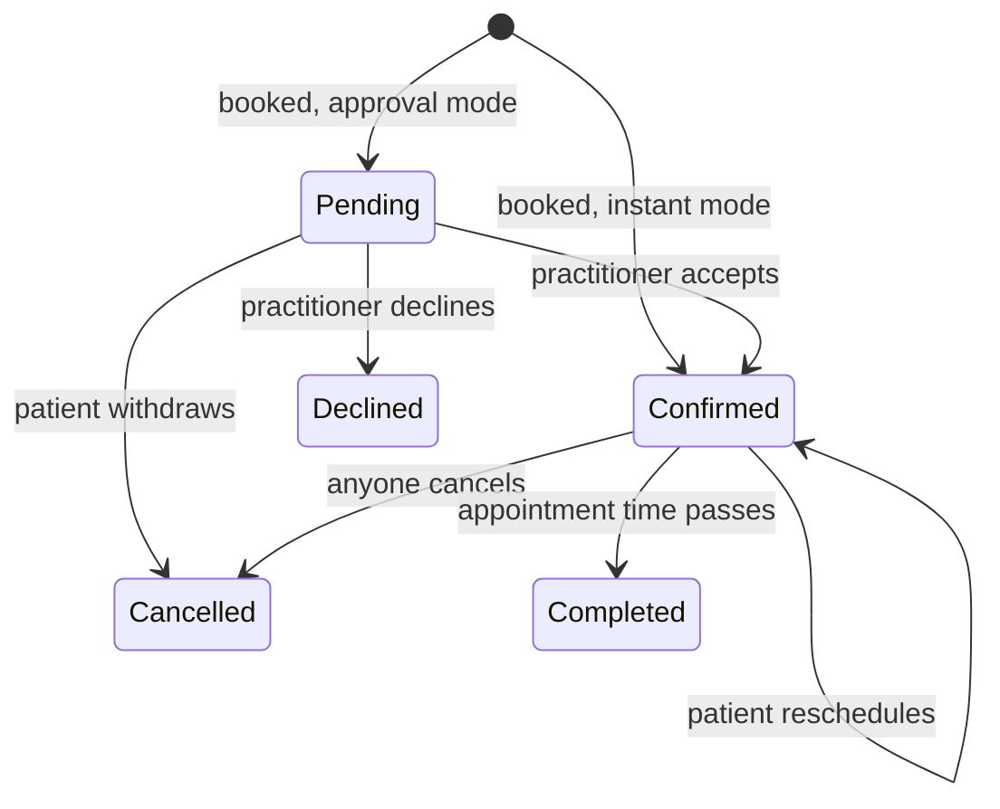

# Front-end outline

> **Status:** draft for team review · **Last updated:** 2026-10-06
>
> How Care Track looks and works from the user's side: who uses it, which pages exist, how people move between them, and the visual system. Data fetching, forms, and auth logic are only described here. The team writes that code (see [AGENTS.md](../AGENTS.md)).

## Decisions so far

| Topic | Decision |
| --- | --- |
| Roles in v1 | Patient, practitioner, clinic staff |
| Booking | Each practitioner picks **instant** (Confirmed right away) or **approval** (Pending until they accept) |
| Finding care | Search by service or specialty plus location, sorted by **soonest opening** |
| Public access | Search, profiles, and clinic pages are public. Signing in is required to book |
| Availability | Weekly hours plus date exceptions (days off, extra hours) |
| Clinics | A practitioner is either solo or belongs to one clinic |
| Clinic staff can | Manage the clinic profile and roster, and book for patients (find an existing patient or create one). They **can't** edit schedules or approve requests |
| Changing appointments | Patients can cancel or reschedule. Practitioners and staff can cancel, with a reason |
| Booking form | Reason for visit only. Name, date of birth, and phone come from the account |
| Look | Light, clinical, one teal accent. No dark mode in v1 |
| Devices | Patient pages are designed mobile-first and dashboards desktop-first. Everything is responsive |

## Who uses it

- **Patient:** finds the soonest opening for a service, books it, and keeps track of upcoming appointments. Mostly on a phone. May be older or not comfortable with technology.
- **Practitioner:** sets weekly hours, answers booking requests if they use approval mode, and checks today's agenda. Mostly on a desktop between visits.
- **Clinic staff (front desk):** books phone and walk-in patients into any practitioner at their clinic, keeps the clinic profile and roster current, and watches the clinic's day.

## Site map

Three layouts: public pages, auth pages, and the signed-in app. All three are **route groups under one root layout**, so moving between them is still a client-side navigation. (Separate root layouts would force a full page reload.)

| URL | Who | Purpose |
| --- | --- | --- |
| `/` | Everyone | Landing page. The hero *is* the search form |
| `/search?service=&near=&from=` | Everyone | Results sorted by soonest opening |
| `/practitioners/[id]` | Everyone | Profile with a slot picker |
| `/clinics/[id]` | Everyone | Clinic info and its practitioners with their next openings |
| `/login?next=` | Signed out | Sign in, then return to `next` |
| `/signup?as=patient\|practitioner\|clinic&next=` | Signed out | Create an account |
| `/dashboard` | All roles | Role-specific home (see [Screens](#screens)) |
| `/appointments?status=` | All roles | List with tabs for Upcoming, Pending, Past, and Cancelled. Patients and practitioners see their own appointments; staff see the whole clinic's |
| `/appointments/[id]` | Involved parties | Details, history, and role-based actions |
| `/book/[slotId]?reschedule=` | Patient, staff | Confirm a booking or a reschedule |
| `/availability` | Practitioner | Booking mode, slot length, weekly hours, exceptions |
| `/clinic` | Staff | Clinic profile and practitioner roster |
| `/clinic/book` | Staff | The clinic's practitioners with open slots, as the starting point for booking a patient |
| `/settings` | All roles | Account details. Practitioners also edit their public profile here |

Pending requests are a **tab on `/appointments`**, not a separate inbox page. `/clinic` (your clinic) and `/clinics/[id]` (public directory) are different pages on purpose.

### Folder structure

```
app/
  layout.tsx                  <html>, <body>, fonts, metadata only
  globals.css
  (public)/
    layout.tsx                Topbar + Footer
    page.tsx                  /
    search/page.tsx
    practitioners/[id]/page.tsx
    clinics/[id]/page.tsx
  (auth)/
    layout.tsx                logo + centered card, no footer
    login/page.tsx            (exists)
    signup/page.tsx
  (app)/
    layout.tsx                AppShell: sidebar on desktop, top bar + menu on mobile
    dashboard/
      page.tsx                renders the home for the signed-in role
      _components/            PatientHome, PractitionerHome, StaffHome, StatCard
    appointments/page.tsx
    appointments/[id]/page.tsx
    book/[slotId]/page.tsx
    availability/page.tsx
    clinic/page.tsx
    clinic/book/page.tsx
    settings/page.tsx
  api/                        backend, written by the team
components/                   UI shared across routes
```

Shared UI goes in `components/`. UI used by only one route goes in that route's `_components/` folder (the underscore keeps it out of routing). In this Next.js version, `params` and `searchParams` are **Promises**. Type pages with the global helpers, e.g. `PageProps<'/practitioners/[id]'>`.

## Navigation

**Public top bar:** logo · Find care · For practitioners (a section on the landing page) · Log in · **Sign up** (primary button). When signed in, the last two are replaced by **Dashboard**.

**App shell:** a left sidebar at `lg` and above. Below `lg` it becomes a top bar with a menu button that opens the nav using the native `popover` attribute, so no JavaScript state is needed. The user's name, role, and **Log out** sit at the bottom of the nav.

| Patient | Practitioner | Clinic staff |
| --- | --- | --- |
| Home | Today | Clinic today |
| Find care → `/search` | Appointments (with pending count) | Book for a patient → `/clinic/book` |
| Appointments | Availability | Appointments |
| Settings | Settings | Clinic |
| | | Settings |

The current page's nav link gets `aria-current="page"` and the soft-accent background.

## Appointment status



| Status | Badge | Extra text on cards |
| --- | --- | --- |
| Pending | amber | "Waiting for Dr. Rivera to confirm" |
| Confirmed | green | none |
| Declined | red | The practitioner's note, if any |
| Cancelled | gray | "Cancelled by {patient / Dr. Rivera / Northside Clinic}" plus the reason |
| Completed | gray | none |

A badge always shows its text label, so color is never the only signal.

## Key flows

**A. Patient finds and books**
1. On `/` or `/search`, the patient enters a service and a location. Results are sorted by next opening.
2. They tap a **time chip** on a result to go straight to booking, or tap the card to open the profile and pick a day and time.
3. On `/book/[slotId]`, a signed-out patient is sent to `/login?next=/book/[slotId]`. The "Create an account" link carries `next` along, so they come back to the same slot either way.
4. They enter a reason and press **Book appointment** (instant mode) or **Request appointment** (approval mode). The button label tells them which mode applies.
5. They land on `/appointments/[id]` with a banner: "You're booked" or "Request sent. We'll update this page when Dr. Rivera responds."
6. If someone took the slot in the meantime, the book page shows "Someone just booked this time" with a link back to the profile.

**B. Practitioner answers a request.** The dashboard's "Needs your response" list (or `/appointments?status=pending`) has **Accept** (one click) and **Decline**, which opens a dialog with an optional note. The row disappears and a short confirmation shows.

**C. Patient reschedules.** On `/appointments/[id]`, **Reschedule** goes to `/practitioners/[id]?reschedule=[apptId]`, where a banner says "Pick a new time for your Tue, Oct 8 appointment". Choosing a slot goes to `/book/[slotId]?reschedule=[apptId]`, which shows "From → To" with the reason pre-filled, then **Confirm new time**.

**D. Cancel.** On the detail page, **Cancel appointment** opens a `<dialog>` with a reason field. The reason is required for practitioners and staff and optional for patients. The appointment then shows as Cancelled, with who cancelled it and why.

**E. Front desk books for a patient**
1. **Book for a patient** opens `/clinic/book`, which lists the clinic's practitioners with open slots.
2. Choosing a slot opens `/book/[slotId]`. For staff, this page has an extra **Patient** step at the top: search by name, date of birth, or phone, then pick a match or choose **New patient** (name, date of birth, phone).
3. They enter a reason and press **Book**. The appointment shows "Booked by front desk".

**F. Practitioner sets up availability.** A new practitioner's dashboard shows an empty state: "No open times yet. Set your weekly hours." This leads to `/availability`, where they set the booking mode, slot length, weekly hours, and exceptions, then **Save**. Their profile now shows openings.

## Screens

Wireframes show the layout, not final copy. All names are fictional.

### `/` Landing

- The hero holds the headline (e.g. "See who's open. Book sooner."), one supporting line, and the **search form** (service, location, **Find openings**). Searching is the main action, so it isn't behind a "Get started" button.
- **How it works** has three numbered steps: search, pick a time, get confirmed.
- **For practitioners and clinics** briefly explains publishing hours and has a **Sign up** link to `/signup?as=practitioner`.
- Collapses to one column on mobile.

### `/search` Results

```
┌────────────────────────────────┐
│ [Dermatology    ] [Troy, NY  ] │
│ From [Today    ▾]   12 results │
├────────────────────────────────┤
│ (SR) Dr. Sam Rivera            │
│      Dermatology               │
│      Northside Clinic · Troy   │
│      Next open: Tue, Oct 8     │
│      [9:30] [10:30] [2:15]  →  │
├────────────────────────────────┤
│ (JK) Dr. Jo Kim                │
│      ...                       │
└────────────────────────────────┘
```

- Filters live in the URL (`?service=&near=&from=`), so results can be shared and the back button works. It's a plain `<form method="get">`.
- Each card shows up to 3 time chips for the next open day, plus **More times →** linking to the profile.
- Empty state: "No openings for Dermatology near Troy in the next 30 days", with suggestions to widen the location or clear the date.
- Desktop: filters in a left column, results on the right. No map in v1.

### `/practitioners/[id]` Profile and slot picker

```
┌────────────────────────────────┐
│ (SR) Dr. Sam Rivera, MD        │
│      Dermatology               │
│      Northside Clinic · Troy → │
├─ Book an appointment ──────────┤
│ Confirmed instantly            │
│ ◀  Oct 7 – Oct 13           ▶  │
│ Mon Tue Wed Thu Fri Sat Sun    │
│  7  [8]  9  10  11  12  13     │
│  –   3   5   –   2   –   –     │ ← open times per day
│ Tue, Oct 8 · times in EDT      │
│ [ 9:00 ] [ 9:30 ] [10:30 ]     │
├─ About ────────────────────────┤
│ Services · Location · Bio      │
└────────────────────────────────┘
```

- The booking mode line reads "Confirmed instantly" or "Dr. Rivera reviews each request".
- Days with no openings are disabled but still visible, so the week keeps its shape. Each time chip is a link to `/book/[slotId]`.
- Desktop: profile on the left, a sticky slot picker on the right.

### `/clinics/[id]` Clinic

The clinic's name, address, phone, and services, followed by its practitioners as the same cards used in search results. `/clinic/book` reuses this list inside the app shell.

### `/login`, `/signup`

- Both use a centered card on a plain background. Login links to Sign up and the other way round, and both carry `next` along.
- `/signup` first asks "I'm a patient / I'm a practitioner / I manage a clinic" as three large cards, then shows that role's form:
  - **Patient:** name, email, password, date of birth, phone.
  - **Practitioner:** name, email, password, specialty, credentials. They join a clinic later through an invite.
  - **Clinic staff:** their account, then the clinic's name, address, and phone. This creates the clinic.

### `/book/[slotId]` Confirm

```
┌────────────────────────────────┐
│ ← Back to Dr. Rivera           │
│ Confirm your appointment       │
│ ┌────────────────────────────┐ │
│ │ Tue, Oct 8 · 10:30 AM EDT  │ │
│ │ 30 min · Dr. Sam Rivera    │ │
│ │ Northside Clinic, Troy, NY │ │
│ └────────────────────────────┘ │
│ ┌ Staff only ────────────────┐ │
│ │ Patient                    │ │
│ │ [Search name, DOB, phone ] │ │
│ │ + New patient              │ │
│ └────────────────────────────┘ │
│ Reason for visit               │
│ [                            ] │
│ ⓘ Dr. Rivera reviews requests  │
│   before confirming.           │
│ [     Request appointment    ] │
└────────────────────────────────┘
```

When rescheduling, the summary box shows the old time crossed out above the new one.

### `/dashboard`: patient

```
┌────────────────────────────────┐
│ Hi, Jordan                     │
│ ┌ Next appointment ──────────┐ │
│ │ Tue, Oct 8 · 10:30 AM      │ │
│ │ Dr. Sam Rivera · Derm.     │ │
│ │ Northside Clinic, Troy     │ │
│ │ [Confirmed]                │ │
│ │ [Reschedule]   [Cancel]    │ │
│ └────────────────────────────┘ │
│ Waiting for confirmation (1)   │
│  Thu, Oct 17 · MRI  [Pending]  │
│ Upcoming (2)       View all →  │
│ [   Find an appointment     ]  │
└────────────────────────────────┘
```

Empty state: "No appointments yet", with a **Find an appointment** button.

### `/dashboard`: practitioner

```
┌───────────┬──────────────────────────────────────────────┐
│ CareTrack │ Today · Tue, Oct 8              [Edit hours] │
│           │ ┌──────────┐ ┌──────────┐ ┌────────────────┐ │
│ ▸ Today   │ │ 6 booked │ │ 2 to     │ │ Next opening   │ │
│ Appts (2) │ │ today    │ │ review   │ │ Thu, 9:00 AM   │ │
│ Avail.    │ └──────────┘ └──────────┘ └────────────────┘ │
│ Settings  │ Needs your response                          │
│           │ Thu 9:30 · J. Doe · "rash" [Decline][Accept] │
│           │ Today's agenda                               │
│           │ 9:00   J. Doe     Follow-up       Confirmed  │
│           │ 9:30   ── open ──                            │
│           │ 10:00  A. Smith   New patient     Confirmed  │
│ Dr. Rivera│                                              │
│ Log out   │                                              │
└───────────┴──────────────────────────────────────────────┘
```

Leave the "Needs your response" section out when the practitioner uses instant mode. A pending clinic invite appears here as a banner: "Northside Clinic invited you to join" with **Accept** and **Decline**.

### `/dashboard`: clinic staff

```
Northside Clinic · Today, Tue Oct 8        [Book for a patient]
┌ Dr. Rivera ─────────┐┌ Dr. Kim ────────────┐┌ Dr. Patel ─────┐
│ 9:00  J. Doe        ││ 9:00  ── open ──    ││ Off today      │
│ 9:30  ── open ──    ││ 9:30  B. Lee        ││                │
│ 10:00 A. Smith      ││ 10:00 C. Diaz       ││                │
└─────────────────────┘└─────────────────────┘└────────────────┘
```

There is one column per practitioner, and the columns stack on mobile. Clicking an open row goes straight to `/book/[slotId]`.

### `/appointments`, `/appointments/[id]`

- **List:** tabs for Upcoming, Pending, Past, and Cancelled, kept in `?status=`. Rows are grouped by date. Staff also get a practitioner filter.
- **Detail:** the date and time with a status badge, who, where (with address), the reason, a short history ("Booked Oct 1 · Confirmed Oct 1"), and then the actions:

| Status | Patient | Practitioner | Staff |
| --- | --- | --- | --- |
| Pending | Withdraw request | Accept · Decline | none |
| Confirmed | Reschedule · Cancel | Cancel (reason) | Cancel (reason) |
| Others | none | none | none |

### `/availability` (practitioner)

```
Availability                                    [Save changes]
Booking mode  (•) Confirm instantly  ( ) Review each request
Slot length   [30 min ▾]

Weekly hours · times in EDT
Mon [✓] [09:00]–[12:00]  [13:00]–[17:00]  [+]
Tue [✓] [09:00]–[17:00]                   [+]
Wed [ ] Unavailable
...

Exceptions                                    [+ Add exception]
Mon, Oct 14   Closed · Holiday                       [Remove]
Fri, Oct 18   10:00–14:00 only                       [Remove]

Preview · next 14 days · 86 open times   (same day strip as the profile)
```

- Use native `<input type="time">` and `<input type="date">` and don't add a picker library.
- If new hours leave existing bookings outside them, show a warning: "3 booked appointments fall outside your new hours. They stay booked."

### `/clinic` (staff)

- **Clinic profile:** a form for name, address, phone, and services (add or remove chips).
- **Practitioners:** a table of name, specialty, and status (Active or Invited), with a **Remove** button on each row. **Invite practitioner** opens a dialog that asks for their email.

### `/settings`

Account details (name, email, password). Patients also edit date of birth and phone. Practitioners also edit their public profile (photo, credentials, specialty, services, bio), and the page links to **View public profile**.

## Shared components

| Component | Used on | Notes |
| --- | --- | --- |
| `Topbar`, `Footer` | Public layout | Both exist. Restyle and update links |
| `AppShell` | App layout | Sidebar or top bar, with role nav passed in as a prop |
| `PageHeader` | Every app page | Title, optional description, actions on the right |
| `PractitionerCard` | Search, clinic page, `/clinic/book` | Avatar (initials when there's no photo), name, specialty, clinic, next opening, time chips |
| `SlotPicker` | Profile, reschedule | Week strip plus time chips for the selected day |
| `AppointmentCard` | Dashboards, lists | Time, the other party, location, `StatusBadge`. A `compact` prop gives the agenda-row version |
| `StatusBadge` | Everywhere | Status → label + color |
| `StatCard` | Dashboards | Exists. Move it to `dashboard/_components/` |
| `EmptyState` | Lists, search, dashboards | Icon, title, one line of text, one action |
| `ConfirmDialog` | Cancel, decline, invite, remove | Native `<dialog>` + `showModal()`, which provides the focus trap and Esc to close |
| `Avatar` | Cards, profile, nav | Photo, or initials on a soft-accent circle |

`WeeklyHoursEditor` and `PatientPicker` are each used in one place, so they live in their route's `_components/`.

## Visual design

### Color

Semantic tokens point at Tailwind's built-in palette, so the theme lives in one place. This replaces the dark tokens in [globals.css](../app/globals.css):

```css
@theme inline {
  --color-bg: var(--color-slate-50);           /* page background */
  --color-surface: var(--color-white);         /* cards, inputs */
  --color-line: var(--color-slate-200);        /* card borders, dividers */
  --color-line-strong: var(--color-slate-500); /* input and checkbox borders */
  --color-ink: var(--color-slate-900);         /* body text */
  --color-muted: var(--color-slate-600);       /* secondary text */
  --color-accent: var(--color-teal-700);       /* primary buttons, links, selected slot */
  --color-accent-hover: var(--color-teal-800);
  --color-accent-soft: var(--color-teal-50);   /* time chips, active nav (text: teal-800) */
  --color-focus: var(--color-teal-600);        /* focus ring */
}
```

This gives classes like `bg-surface`, `text-muted`, `border-line`, and `bg-accent`.

Contrast was checked against WCAG AA:

| Pair | Ratio | Needs |
| --- | --- | --- |
| ink on bg | ~17:1 | 4.5 |
| muted on white / bg | ~7.5 / 7.2:1 | 4.5 |
| white on accent (buttons) | ~5.5:1 | 4.5 |
| teal-800 on accent-soft (chips) | ~7.3:1 | 4.5 |
| line-strong on white (input borders) | ~4.8:1 | 3 |
| focus ring on white | ~3.7:1 | 3 |

- Don't use text lighter than `slate-600`. `slate-400` input borders fail (2.6:1).
- Status badges use the `-50` shade as background with dark text: green-800, amber-800, red-700, or slate-700 on slate-100. All are above 5.9:1.

### Type, shape, spacing

- **Font:** Geist Sans is already loaded by `next/font` but isn't applied, because `:root` sets `Inter, …`. Put `font-sans` on `<body>`.
- **Sizes:** body text is `text-base` (16px). Inputs must be at least 16px, or iOS zooms in on focus. Page titles are `text-2xl font-semibold` and section titles `text-lg font-semibold`. Metadata uses `text-sm text-muted`. Keep the large `clamp()` heading for the landing hero only.
- **Shape:** cards are `rounded-xl border border-line bg-surface shadow-sm`. Buttons and inputs are `rounded-lg`. Badges and chips are `rounded-full`.
- **Touch targets:** buttons, chips, and nav links are at least 44px tall.
- **Width:** public pages use `max-w-6xl` and app pages `max-w-5xl`, with `px-4 sm:px-6`.
- **Motion:** only clickable cards lift on hover. Wrap every transition in `motion-safe:`.

### Buttons

| Variant | Look | Use |
| --- | --- | --- |
| Primary | teal fill, white text | One per screen: Book, Save, Find openings |
| Secondary | white, `border-line`, ink text | Reschedule, Back, filters |
| Danger | red-700 fill | Only the final confirm in a cancel or remove dialog |
| Link | teal text, underline on hover | Inline actions ("View all →") |

### Icons and logo

- **Icons:** copy the dozen or so that are needed (calendar, clock, map-pin, search, user, check, x, menu, chevron, info, plus) from [Lucide](https://lucide.dev) (ISC license) as inline SVGs in `components/icons.tsx`. Use 20px and stroke 2. Add `aria-hidden` when an icon sits next to text. Add the `lucide-react` package only if the list keeps growing.
- **Logo:** replace the `>_` mark with a white plus or calendar-check on a teal rounded square. **Don't use a red cross.** The Red Cross emblem is legally protected.

### Writing

Use plain words and short sentences. Name buttons after what they do ("Book appointment", not "Submit"). Write dates out, like "Tue, Oct 8 · 10:30 AM EDT".

## Loading, empty, error

- Each data page gets a `loading.tsx` skeleton shaped like the real layout and an `error.tsx` with a **Try again** button. An unknown `[id]` calls `notFound()`, which renders a friendly `not-found.tsx`.
- Every list has an `EmptyState` that offers the next step.
- Form errors appear at the top of the form *and* under the field, linked with `aria-describedby`. The submit button shows "Booking…" while it's pending.
- **Dates and times:** one helper built on `Intl.DateTimeFormat`, so no date library is needed. Show times in the **clinic's or practitioner's time zone** with its abbreviation. Wrap dates in `<time dateTime="…">`.

## Accessibility checklist

- [ ] One `<h1>` per page. Use the `header`/`nav`/`main`/`footer` landmarks, plus a "Skip to content" link.
- [ ] Every input has a visible `<label>`. Don't use placeholder text as the label.
- [ ] A visible focus ring everywhere (`focus-visible:ring-2 ring-focus ring-offset-2`).
- [ ] Time chips and days are real links or buttons. The selected day has `aria-pressed`.
- [ ] Status is always shown as text, never by color alone.
- [ ] Dialogs use `<dialog>` + `showModal()`.
- [ ] Everything works using only the keyboard, and at 200% browser zoom.

## Changes to current code

| Where | Change |
| --- | --- |
| [app/layout.tsx](../app/layout.tsx) | Keep only html, body, and fonts. Move `Topbar`/`Footer` into `(public)/layout.tsx`. Replace the "Generated by create next app" description |
| [app/page.tsx](../app/page.tsx) | Move it to `(public)/page.tsx` (the URL stays `/`). Replace the placeholder copy. Remove the `/contact` link, since that page doesn't exist. Change `grid-cols-3` to `sm:grid-cols-2 lg:grid-cols-3` |
| [components/topbar.tsx](../components/topbar.tsx) | Change `/about` (no page) to the new nav. Change the `<a href="/">` logo to `<Link>` |
| [components/footer.tsx](../components/footer.tsx) | Fix the typo "valulable" |
| [app/(auth)/login/page.tsx](../app/(auth)/login/page.tsx) | Fix the typo `exmaple`. Add a link to Sign up. `fetch('api/auth/login')` has no leading slash, so it only works because `/login` is at the top level. Use `/api/auth/login`. Support `?next=` (see the note below) |
| [app/dashboard/page.tsx](../app/dashboard/page.tsx) | Move it to `(app)/dashboard/`. `w-80vw` isn't a valid class. `grid-cols-3 sm:grid-cols-2` goes from 3 columns down to 2 as the screen gets wider; use `sm:grid-cols-2 lg:grid-cols-3`. Replace the 5 placeholder cards with the role homes |
| [StatCard.tsx](../app/dashboard/components/StatCard.tsx) | `p-30` is 120px of padding, so use `p-5`. Fix the typo `text-sx` (should be `text-xs`). Move it to `_components/` |
| [app/globals.css](../app/globals.css) | Switch to the light tokens. Remove `input:focus { outline: none }`, which hides keyboard focus. Make `.hero` one column below `lg`. Only lift `.card` on hover when the card is a link |

**Note for whoever builds auth:** after login, only follow `next` when it starts with a single `/`, or the login page becomes an open redirect. `proxy.ts` (the new name for middleware) can send signed-out users from the `(app)` routes to `/login?next=…`. Still check the user's role on the server for each page.

## Build order

The screens can be built against **typed mock data** before the API exists, so front-end and back-end work can run in parallel.

1. **Foundation:** light tokens, the three layouts, the `AppShell` with role nav, and the shared components with mock data.
2. **Patient booking path:** landing → search → profile → book → appointment detail → patient dashboard.
3. **Practitioner:** availability editor, dashboard, and accept/decline.
4. **Changes:** cancel dialogs for all roles, then patient reschedule.
5. **Clinic staff:** `/clinic` profile and roster, `/clinic/book`, the patient picker on the book page, and the staff dashboard.

### What the screens need from the API

| Entity | Fields the UI shows |
| --- | --- |
| Practitioner | id, name, credentials, specialty, services, bio, photo, clinic (id, name, city), booking mode, time zone, next opening |
| Clinic | id, name, address, phone, services, practitioners |
| Slot | id, practitioner id, start, end |
| Appointment | id, slot (start/end), patient, practitioner, clinic, status, reason, booked by, cancelled by + reason, decline note, history entries |
| Patient | id, name, date of birth, phone, has account (false for records created by the front desk) |

## Not in v1

Maps and distance sorting · email/SMS reminders · insurance and payments · messaging · intake forms and medical records · video visits · practitioners at several locations · site admin and practitioner verification · dark mode · translations · a waitlist ("tell me if an earlier time opens"), which would be a strong later feature given the app's pitch.

## Open questions

1. **Rescheduling with approval mode:** keep the original time until the new one is accepted? *Suggested: yes, and show "Reschedule pending" on the card.*
2. **Staff booking an approval-mode practitioner:** should it still be Pending? *Suggested: yes, follow the practitioner's mode so there's no special case.*
3. **Cancellation cutoff:** can a patient cancel 1 hour before?
4. **Booking window:** how far ahead can patients book (14 days? 60)? This sets how far the slot picker scrolls.
5. **Privacy:** can clinic staff read a patient's reason for visit?
6. **About page:** build it or drop the link?
